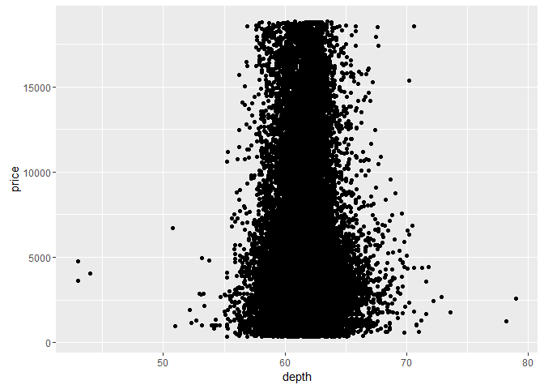

# Diamond Prices EDA Problem Set 4
Manu Kushwaha  
April 8, 2016  


```r
# Loading the required libraries
library(ggplot2)
suppressMessages(library(dplyr))
suppressMessages(library(gridExtra))
```


```r
# Loading the diamonds dataset into "d" and creating the scatterplot
d <- diamonds
```

### Q1) Price vs. X
* First task is to create a scatterplot of price vs x. using the ggplot syntax.

```r
ggplot(aes(x = x, y = price), data = d) +
  geom_point() +
  scale_x_discrete(breaks = seq(0, 11, 1))
```

\

***

### Q2) Finding - Price vs. X
#### What are your observations about the scatterplot of price vs. x?
* Displays a parabolic/exponential relationship between price and x
* Exponential rise in the diamond price after x = 6mm
* Vertical bands of concentrated price data at x = 7.5mm and ~8.2mm which could indicate a presense of other factors that determine the potential segregation of price at these bands
* Has outliers at x = 0mm

***

### Q3) Correlations
#### What are the correlations between price and x, y and z to 2 decimal places 

```r
with(d, cor.test(x, price))
```

```
## 
## 	Pearson's product-moment correlation
## 
## data:  x and price
## t = 440.16, df = 53938, p-value < 2.2e-16
## alternative hypothesis: true correlation is not equal to 0
## 95 percent confidence interval:
##  0.8825835 0.8862594
## sample estimates:
##       cor 
## 0.8844352
```


```r
with(d, cor.test(y, price))
```

```
## 
## 	Pearson's product-moment correlation
## 
## data:  y and price
## t = 401.14, df = 53938, p-value < 2.2e-16
## alternative hypothesis: true correlation is not equal to 0
## 95 percent confidence interval:
##  0.8632867 0.8675241
## sample estimates:
##       cor 
## 0.8654209
```


```r
with(d, cor.test(z, price))
```

```
## 
## 	Pearson's product-moment correlation
## 
## data:  z and price
## t = 393.6, df = 53938, p-value < 2.2e-16
## alternative hypothesis: true correlation is not equal to 0
## 95 percent confidence interval:
##  0.8590541 0.8634131
## sample estimates:
##       cor 
## 0.8612494
```

***

### Q4) Price vs. Depth
* Create a scatterplot of Price vs. depth

```r
ggplot(aes(x = depth, y = price), data = d) +
  geom_point()
```

\

***

### Q5) Adjustments - Price vs. Depth
* Change the code to make the transparency of the points to be 1/100 of what they are now and mark the x-axis every 2 units

```r
ggplot(aes(x = depth, y = price), data = d) +
  geom_point(alpha = 1/100) +
  scale_x_continuous(breaks = seq(43, 79, 2))
```

\

***

### Q6) Typical depth range
#### Based on the scatterplot of depth vs price, most diamonds are between what values of depth?
* Answer: Between ~59mm to ~64mm

***

### Q7) Correlation - Price and Depth
#### What is the correlation of depth vs. price?

```r
with(d, cor.test(depth, price))
```

```
## 
## 	Pearson's product-moment correlation
## 
## data:  depth and price
## t = -2.473, df = 53938, p-value = 0.0134
## alternative hypothesis: true correlation is not equal to 0
## 95 percent confidence interval:
##  -0.019084756 -0.002208537
## sample estimates:
##        cor 
## -0.0106474
```

#### Based on the correlation coefficient, would you use depth to predict the price of diamond? Why?
* Answer: No, because the near zero correlation coefficient value of -0.01 indicates that there is no correlation between the two.

***

### Q8) Price vs Carat
* Create a scatterplot of price vs carat and omit the top 1% of price and carat values

```r
ggplot(aes(x = carat, y = price), data = d) +
  geom_point() +
  xlim(0, quantile(d$carat, 0.99)) +
  ylim(0, quantile(d$price, 0.99))
```

```
## Warning: Removed 926 rows containing missing values (geom_point).
```

\

***

### Q9) Price vs. Volume
* Create a scatterplot of price vs. volume (x * y * z). This is a very rough approximation for a diamond's volume.

```r
ggplot(aes(x = (x * y * z), y = price), data = d) +
  geom_point()
```

\

* Create a new variable for volume in the diamonds data frame.

```r
d$volume <- (d$x * d$y * d$z)
```

***

### Q10) Findings - Price vs. Volume
#### What are your observations from the price vs. volume scatterplot?
* Some price outliers are noticed when volume is 0, and, 1 outlier at volume ~3800mm^3
* With the current scale, there seems to be an exponential relationship between price and volume (although linear can also be plausible)
* Vertical bands of price segregation are noticed between the volume of 200mm^3 and 500mm^3

***

### Q11) Correlation on Subsets
#### What is the correlation of price and volume? 
* Exclude diamonds that have a volume of 0 or that are greater than or equal to 800


```r
with(subset(d, volume > 0 & volume <= 800), cor.test(volume, price))
```

```
## 
## 	Pearson's product-moment correlation
## 
## data:  volume and price
## t = 559.19, df = 53915, p-value < 2.2e-16
## alternative hypothesis: true correlation is not equal to 0
## 95 percent confidence interval:
##  0.9222944 0.9247772
## sample estimates:
##       cor 
## 0.9235455
```


```r
# Number of outlier diamonds with 0 volume
sum(d$volume == 0)
```

```
## [1] 20
```

***

### Q12) Adjustments - Price vs. Volume
* Subset the data to exclude diamonds with a volume greater than or equal to 800. Also, exclude diamonds with a volume of 0. Adjust the transparency of the points and add a linear model to the plot


```r
ggplot(aes(x = volume, y = price), data = subset(d, volume > 0 & volume <= 800)) + 
  geom_jitter(alpha = 1/100) +
  geom_smooth(method = "lm", color = "red")
```

\

#### Do you think this would be a useful model to estimate the price of diamonds? Why or why not?
* Answer: Not sure as there maybe a correlation based on the value of the coefficient which is relatively close to 1. However, there is a significant amount of variation in price on the upside as the volume increases above 150mm^3 which makes the correlation hard to conceive

***

### Q13) Mean Price by Clarity
* Use the function dplyr package to create a new data frame containing info on diamonds by clarity
* Name the data frame "diamondsByClarity"
* The data frame should contain the following variables in this order:
    (1) mean_price
    (2) median_price
    (3) min_price
    (4) max_price
    (5) n - where n is the number of diamonds in each level of clarity.


```r
diamondsByClarity <- d %>%
  group_by(clarity) %>% 
  summarize(mean_price = mean(price),
              median_price = median(price),
              min_price = min(price),
              max_price = max(price),
              n = n())

diamondsByClarity
```

```
## Source: local data frame [8 x 6]
## 
##   clarity mean_price median_price min_price max_price     n
##    (fctr)      (dbl)        (dbl)     (int)     (int) (int)
## 1      I1   3924.169         3344       345     18531   741
## 2     SI2   5063.029         4072       326     18804  9194
## 3     SI1   3996.001         2822       326     18818 13065
## 4     VS2   3924.989         2054       334     18823 12258
## 5     VS1   3839.455         2005       327     18795  8171
## 6    VVS2   3283.737         1311       336     18768  5066
## 7    VVS1   2523.115         1093       336     18777  3655
## 8      IF   2864.839         1080       369     18806  1790
```

***

### Q14) Bar charts of Mean Price
* Summary data frames with the mean price by clarity and color


```r
diamonds_by_clarity <- group_by(d, clarity)
diamonds_mp_by_clarity <- summarise(diamonds_by_clarity, mean_price = mean(price))

diamonds_by_color <- group_by(d, color)
diamonds_mp_by_color <- summarise(diamonds_by_color, mean_price = mean(price))
```

* Your task is to write additional code to create two bar plots on one output image using the grid.arrange() function from the package gridExtra


```r
bp1 <- ggplot(aes(x = clarity, y = mean_price, fill = clarity), data = diamonds_mp_by_clarity) +
  geom_bar(stat = "identity")

bp2 <- ggplot(aes(x = color, y = mean_price, fill = color), data = diamonds_mp_by_color) +
  geom_bar(stat = "identity")

grid.arrange(bp1, bp2, ncol = 2)
```

\

***

### Q15) Trends in Mean Price
#### What do you notice in each of the bar charts for mean price by clarity and mean price by color?
* Answer: Given the fact that clarity ranges from I1 (worst) to IF(best) and color ranges from J(worst) to D(best):
  + Mean price tends to decrease as clarity improves and increases as color gets worse
* This definitely highlights some form of oddity and perhaps, raises the question that some other factors might also need to be considered to get a deeper understanding 

***

### Q16) Mean Price across cut


```r
diamonds_by_cut <- group_by(d, cut)
diamonds_mp_by_cut <- summarise(diamonds_by_cut, mean_price = mean(price))

ggplot(aes(x = cut, y = mean_price, fill = cut), data = diamonds_mp_by_cut) +
  geom_bar(stat = "identity")
```

\


```r
by(diamonds_mp_by_cut$mean_price, diamonds_mp_by_cut$cut, max)
```

```
## diamonds_mp_by_cut$cut: Fair
## [1] 4358.758
## -------------------------------------------------------- 
## diamonds_mp_by_cut$cut: Good
## [1] 3928.864
## -------------------------------------------------------- 
## diamonds_mp_by_cut$cut: Very Good
## [1] 3981.76
## -------------------------------------------------------- 
## diamonds_mp_by_cut$cut: Premium
## [1] 4584.258
## -------------------------------------------------------- 
## diamonds_mp_by_cut$cut: Ideal
## [1] 3457.542
```

* Again a similar odd observation is noticed as with clarity and color, in that, the mean price decreases as the cut gets better and is the lowest for ideal cut, with the exception of the premium cut, which is only about $200 more than the fair cut (worst in cut class)

